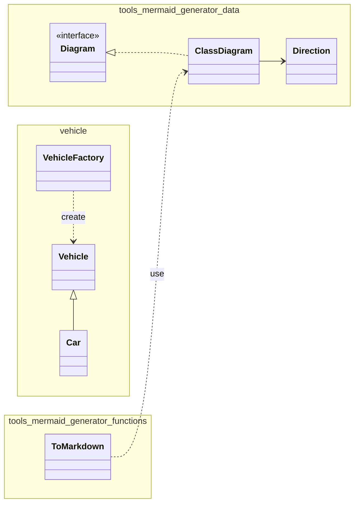

# Mermaid test

```mermaid
classDiagram
direction LR
namespace tools_mermaid_generator_functions {
   class ToMarkdown
}
namespace tools_mermaid_generator_data {
   class Diagram {
      <<interface>>
   }
   class ClassDiagram
   class Direction
}
namespace vehicle {
   class Car
   class Vehicle
   class VehicleFactory
}
Diagram<|..ClassDiagram
Vehicle<|--Car
ToMarkdown..>ClassDiagram: use
VehicleFactory..>Vehicle: create
ClassDiagram-->Direction
```
